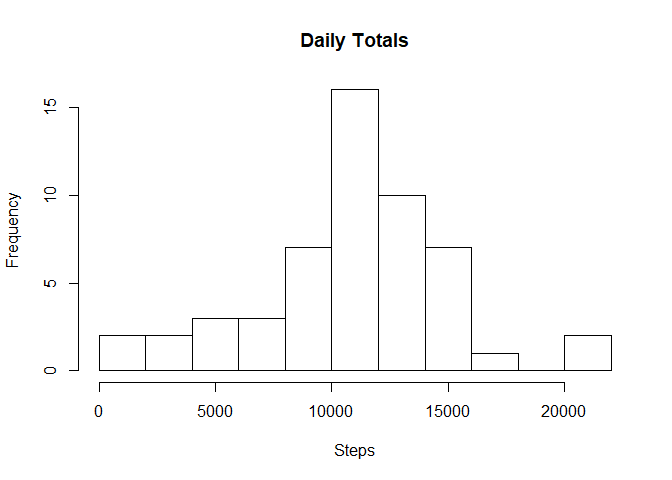
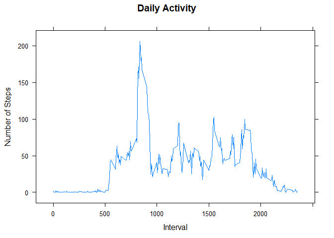
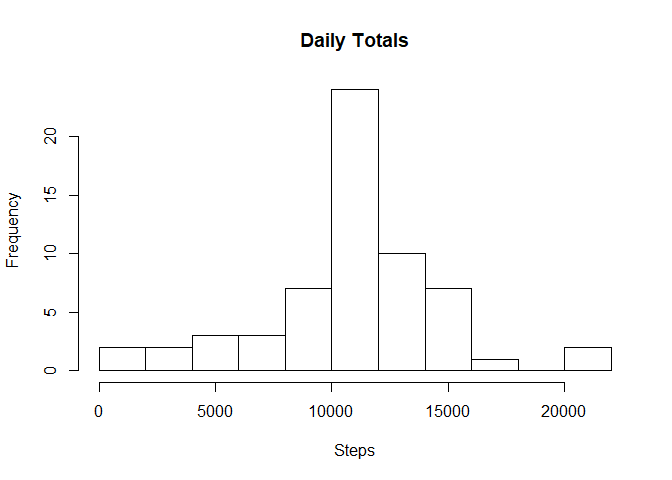
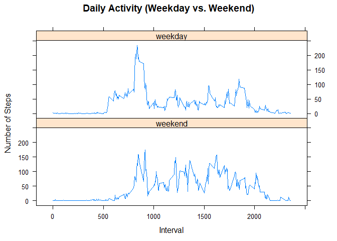

## Loading and preprocessing the data

Make sure the file "activity.csv" is in your working directory and is fully
extracted.

We read the data and print the first few rows.

```r
df <- read.csv("activity.csv")
head(df)
```

```
##   steps       date interval
## 1    NA 2012-10-01        0
## 2    NA 2012-10-01        5
## 3    NA 2012-10-01       10
## 4    NA 2012-10-01       15
## 5    NA 2012-10-01       20
## 6    NA 2012-10-01       25
```


## What is mean total number of steps taken per day?

Using the dplyr package, we group the data by date, and compute daily totals.

```r
library(dplyr)
```

```
## 
## Attaching package: 'dplyr'
```

```
## The following objects are masked from 'package:stats':
## 
##     filter, lag
```

```
## The following objects are masked from 'package:base':
## 
##     intersect, setdiff, setequal, union
```

```r
by_date <- group_by(df, date)
day_totals <- summarize(by_date, steps = sum(steps))
```

Here are the first few values:

```r
head(day_totals)
```

```
## # A tibble: 6 x 2
##   date       steps
##   <fct>      <int>
## 1 2012-10-01    NA
## 2 2012-10-02   126
## 3 2012-10-03 11352
## 4 2012-10-04 12116
## 5 2012-10-05 13294
## 6 2012-10-06 15420
```

A histogram:

```r
hist(day_totals$steps, breaks = 10, main = "Daily Totals", xlab = "Steps")
```

<!-- -->

Mean and median number of daily steps:

```r
mean(day_totals$steps, na.rm = TRUE)
```

```
## [1] 10766.19
```

```r
median(day_totals$steps, na.rm = TRUE)
```

```
## [1] 10765
```


## What is the average daily activity pattern?

```r
library(lubridate)
```

```
## 
## Attaching package: 'lubridate'
```

```
## The following object is masked from 'package:base':
## 
##     date
```

```r
library(lattice)
df$date <- ymd(df$date)
class(df$date)
```

```
## [1] "Date"
```

```r
by_int <- group_by(df, interval)
int_means <- summarize(by_int, mean_steps = mean(steps, na.rm = TRUE))
xyplot(mean_steps ~ interval, data = int_means, xlab = "Interval",
       ylab = "Number of Steps", main = "Daily Activity", type = "l")
```

<!-- -->

Which 5-minute interval, on average across all the days in the dataset, contains the maximum number of steps?

```r
most <- which(int_means$mean_steps == max(int_means$mean_steps, na.rm = TRUE))
int_means[most, ]
```

```
## # A tibble: 1 x 2
##   interval mean_steps
##      <int>      <dbl>
## 1      835       206.
```
The 5-minute interval with the most steps (206) was 8:35AM - 8:40AM.

## Imputing missing values


```r
means_df <- merge(df, int_means)
means_df <- arrange(means_df, date)
missing <- is.na(means_df$steps)
sum(missing)
```

```
## [1] 2304
```

```r
mean(missing)*100
```

```
## [1] 13.11475
```

There were 2304 missing values for the "steps" variable (13.11% of that column).

Our strategy for imputing missing values is to replace the value for each missing
five minute interval with the average for that interval, across all days.


```r
means_df$steps[missing] <- means_df$mean_steps[missing]
means_df <- means_df[ , 1:3]
means_df <- select(means_df, steps, date, interval)
means_df <- group_by(means_df, date)
day_totals_2 <- summarize(means_df, steps = sum(steps))
```

We re-plot the daily totals with imputed values:

```r
hist(day_totals_2$steps, breaks = 10, main = "Daily Totals", xlab = "Steps")
```

<!-- -->

Mean and median number of daily steps (with imputed values):

```r
mean(day_totals_2$steps, na.rm = TRUE)
```

```
## [1] 10766.19
```

```r
median(day_totals_2$steps, na.rm = TRUE)
```

```
## [1] 10766.19
```

Imputing values had no significant impact on the mean or median.


## Are there differences in activity patterns between weekdays and weekends?

```r
new_df <- mutate(df, day_type = factor(wday(df$date) %in% 2:6,
                                       labels = c("weekend", "weekday")))
by_type_int <- group_by(new_df, day_type, interval)
activity <- summarize(by_type_int, mean_steps = mean(steps, na.rm = TRUE))
xyplot(mean_steps ~ interval | day_type, data = activity, layout = c(1,2),
       type = "l", xlab = "Interval", ylab = "Number of Steps", main = "Daily Activity (Weekday vs. Weekend)")
```

<!-- -->
